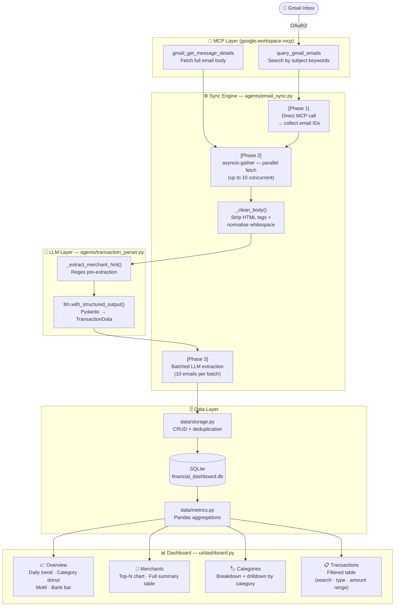

# 📊 Financial Dashboard — Project Newsletter
### *Automated Gmail → Insights Pipeline powered by MCP + LLM*

---

## 🚀 What We Built

A fully automated **personal finance dashboard** that reads your Gmail inbox,
intelligently extracts transaction data using a local LLM, and visualises your
spending — all with zero manual data entry.

Connect your Gmail once. Hit **Sync**. See exactly where your money went.

---

## 🏗️ Architecture



---

## ⚙️ How the Sync Pipeline Works

The sync runs in **three deterministic phases** — LLM is called only in Phase 3.

| Phase | What happens | LLM? |
|---|---|---|
| **① Search** | `query_gmail_emails` tool called directly — returns up to 200 email IDs | ✗ |
| **② Fetch** | `gmail_get_message_details` called in parallel (semaphore: 10 concurrent) | ✗ |
| **③ Parse** | Batches of 10 emails sent to LLM with structured output | ✓ |

### Body Normalisation
Gmail emails arrive as HTML with heavy whitespace from table layouts. Before any
LLM call, the body goes through `_clean_body()`:

```
Raw HTML / whitespace-heavy plain text
        ↓  BeautifulSoup strip tags (if HTML)
        ↓  .splitlines() → strip each line → drop blank lines
Clean plain text  →  passed to regex + LLM
```

This is critical for bank emails (HDFC, Axis) where `Merchant Name:` and the
actual merchant appear on separate lines inside deeply-nested table cells.

### Merchant Pre-Extraction
Rather than relying solely on the LLM's reading of complex prompt rules, a
**regex hint** is injected before the email body:

```
Pre-detected Merchant (regex): KUMARA PARK  ← use this as merchant value unless clearly wrong
```

The LLM simply confirms or overrides the hint — making extraction reliable even
for models running in structured-output mode.

Patterns covered:

| Bank / Format | Regex Pattern |
|---|---|
| HDFC / ICICI | `debited … towards MERCHANT` |
| Axis Bank | `Merchant Name:\n<value>` |
| UPI | `paid to / sent to NAME` |
| NEFT / RTGS | `Beneficiary Name: NAME` |
| Generic | `debited … at MERCHANT` |

---

## 🧠 LLM Integration

```
email_data (subject + from + date + body)
        ↓
_EXTRACTION_PROMPT.format(...)   ← braces in body are escaped to prevent crash
        ↓
llm.with_structured_output(TransactionData)
        ↓
TransactionData (Pydantic)
  ├── is_financial : bool
  ├── amount       : float
  ├── merchant     : str
  ├── category     : str   (food/shopping/travel/fees/…)
  ├── bank_or_source: str
  ├── transaction_type: "debit" | "credit"
  └── confidence   : float  (0.0 – 1.0)
```

Transactions are **filtered out** if:
- `is_financial = False`
- `confidence < 0.5`
- `amount ≤ 0`
- LLM returns `None` (silent parse failure)

**Supported LLM providers** — switch in `agent_config.yaml` with zero code changes:

| Provider | Model example | API key env var |
|---|---|---|
| Mistral *(default)* | `mistral-small-latest` | `MISTRAL_API_KEY` |
| Google Gemini | `gemini-2.0-flash` | `GEMINI_API_KEY` |
| DeepSeek | `deepseek-chat` | `DEEPSEEK_API_KEY` |
| Groq | `llama-3.1-8b-instant` | `GROK_API_KEY` |

---

## 📊 Dashboard Features

Built with **Streamlit + Plotly**, organised into four tabs:

### 📈 Overview
- KPI cards — Total Spent · # Transactions · Avg Transaction · Largest
- Daily spend area chart
- Category donut chart
- Month-over-month bar chart
- Spend by bank / payment app

### 🏪 Merchants
- Configurable top-N slider (5 → 50)
- Colour-gradient horizontal bar chart
- Full merchant table: Rank · Total · Transactions · Avg · % of Spend

### 🏷️ Categories
- Category summary table + horizontal bar chart side-by-side
- Drilldown: select a category → see all its merchants + chart

### 📋 Transactions
Inline filters applied in real time:

| Filter | Type |
|---|---|
| Merchant search | Text input (substring, case-insensitive) |
| Category | Multi-select |
| Transaction type | Multi-select (debit / credit) |
| Amount | Range slider (min → max) |

Counter shows **Showing X of Y transactions** as filters change.

---

## 🔧 Tech Stack

| Layer | Technology |
|---|---|
| Gmail access | `google-workspace-mcp` (MCP stdio server) |
| MCP client | `langchain-mcp-adapters` (MultiServerMCPClient) |
| LLM abstraction | `langchain-core` + provider packages |
| Structured output | `pydantic` v2 (TransactionData model) |
| HTML parsing | `beautifulsoup4` + `lxml` |
| Storage | `sqlite3` (stdlib) |
| Data processing | `pandas` + `python-dateutil` |
| Dashboard | `streamlit` + `plotly` |
| Config | `pyyaml` + `python-dotenv` |

---

## 🔄 Sync Strategy

| Mode | How to trigger | Behaviour |
|---|---|---|
| **Incremental** | 🔄 Sync button / `python agents/email_sync.py` | Fetches only emails newer than last sync timestamp |
| **Full Refresh** | 🗑️ Full Refresh / `--full-refresh` flag | Wipes DB, re-fetches all emails within `lookback_years` |

Emails are deduplicated by Gmail `message_id` — no email is ever parsed twice
during incremental sync.

---

## 📁 Project Structure

```
Financial-Dashboard/
├── agents/
│   ├── common.py              ← LLM factory, MCP config loader
│   ├── email_sync.py          ← Phase 1-3 pipeline, CLI entry point
│   └── transaction_parser.py  ← Regex hint + LLM structured extraction
├── data/
│   ├── storage.py             ← SQLite CRUD, deduplication, sync timestamp
│   └── metrics.py             ← KPIs, daily/monthly/merchant/category aggregations
├── scripts/
│   └── get_google_token.py    ← One-time OAuth2 token helper (opens browser)
├── ui/
│   └── dashboard.py           ← Streamlit app (4 tabs)
├── credentials/               ← gitignored — OAuth JSON + token
├── .env                       ← gitignored — API keys
├── .env.example               ← Committed template
├── agent_config.yaml          ← All runtime config (LLM, MCP, Gmail query)
└── requirements.txt
```

---

## 🚀 Quick Start

```bash
# 1. Install
python -m venv .venv && source .venv/bin/activate
pip install -r requirements.txt

# 2. Credentials
cp .env.example .env          # add API key + Google OAuth vars
python scripts/get_google_token.py   # one-time browser auth

# 3. Run
streamlit run ui/dashboard.py
```

---

*Built with ❤️ using MCP, LangChain, and Streamlit.*
